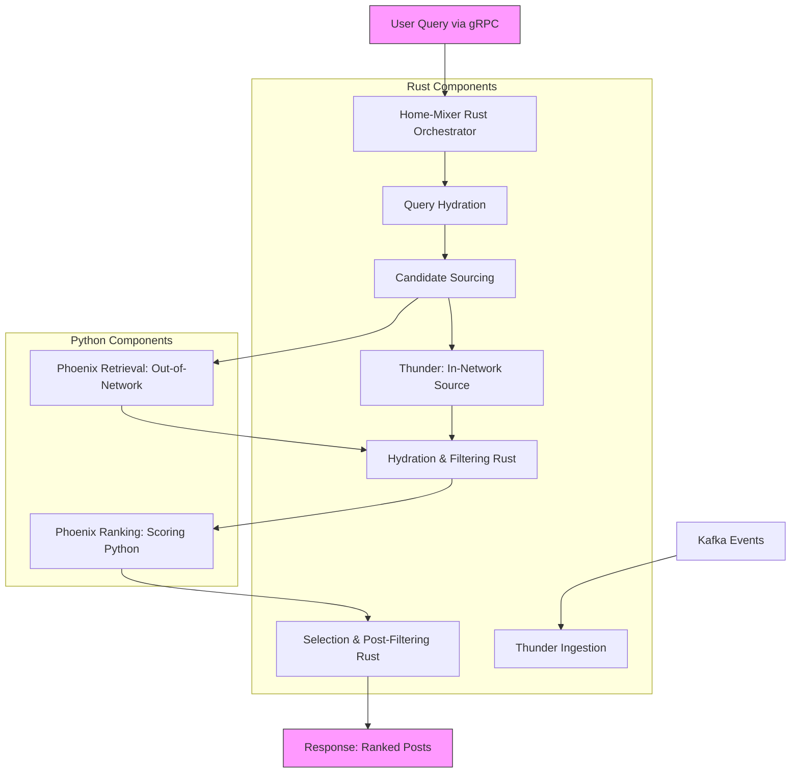
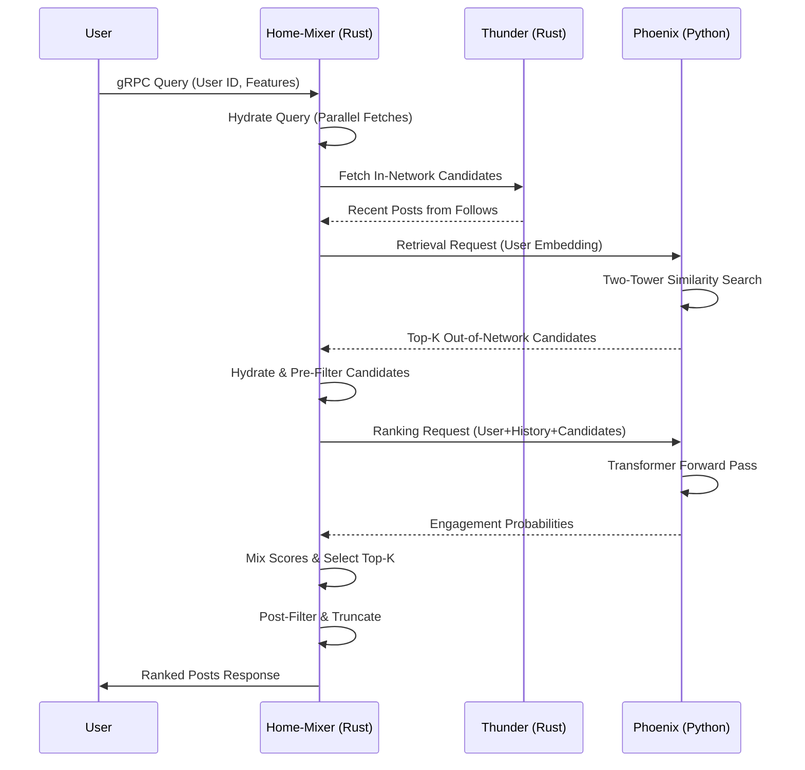

# Codebase Overview

This document provides a comprehensive structural overview of the recommendation system codebase, designed for generating personalized "For You" feeds in a social media platform. The system combines real-time data processing in Rust with machine learning models in Python, emphasizing scalability, low latency, and personalization. It handles both in-network (content from followed users) and out-of-network (discovered content) recommendations, using efficient retrieval, ranking, and mixing to deliver relevant posts.

The architecture is modular and pipeline-based, separating concerns such as data sourcing, enrichment, filtering, scoring, and selection. Key principles include parallelism for performance, error-resilient execution, and specialized ML for engagement prediction. The codebase is organized into directories like `home-mixer/` (Rust orchestration), `thunder/` (real-time ingestion), `phoenix/` (Python ML), and `candidate-pipeline/` (Rust framework), with shared utilities and protobufs for cross-language communication.

For navigation to related pages, see the [sidebar](https://docusaurus.io/docs/sidebar) or links below:
- [Rust Home-Mixer Overview](/docs/rust-home-mixer-overview)
- [Candidate Pipeline](/docs/candidate-pipeline)
- [Selectors](/docs/selectors)
- [Scorers](/docs/scorers)
- [Sources](/docs/sources)
- [Filters](/docs/filters)
- [Python Phoenix Overview](/docs/python-phoenix-overview)
- [RecSys Model](/docs/recsys-model)
- [RecSys Retrieval Model](/docs/recsys-retrieval-model)
- [Runners](/docs/runners)
- [Testing Phoenix](/docs/testing-phoenix)
- [Configuration](/docs/configuration)
- [Data Flow](/docs/data-flow)
- [Auxiliary Components](/docs/auxiliary-components)

## High-Level Architecture

The system follows a microservices-like architecture with Rust handling the core orchestration and data flow for high throughput, while Python focuses on compute-intensive ML inference. Rust components use asynchronous traits for concurrency, ensuring sub-millisecond latencies in critical paths. Python leverages JAX for accelerated computations on accelerators like GPUs/TPUs.

### Main Components
- **Rust Core (home-mixer and candidate-pipeline)**: Orchestrates the end-to-end pipeline for feed assembly. Exposes a gRPC service (`ScoredPostsService`) for user queries, integrating sources, filters, scorers, and selectors. Uses the candidate pipeline framework for modular stage execution.
- **Thunder (Rust)**: Real-time in-memory store for recent posts, ingesting Kafka events for creates/deletes. Serves as a fast source for in-network candidates.
- **Phoenix (Python)**: ML components for out-of-network retrieval and ranking. Includes two-tower retrieval models and transformer-based ranking models, with runners for inference.
- **Shared Elements**: Protobufs (`xai_home_mixer_proto`, `xai_recsys_proto`) for serialization, enabling seamless Rust-Python integration. Utilities for logging, tracing (request IDs), and error handling.

The architecture supports real-time updates via Thunder and approximate nearest neighbor (ANN) search in Phoenix, with hash-based embeddings for sparse feature handling and transformers for contextual encoding.

### Diagram: High-Level Architecture
Below is a Mermaid diagram illustrating the core components and their interactions.

This diagram shows the flow from query intake to response, highlighting Rust's role in orchestration and Python's in ML.

## Key Components

### Rust's Home-Mixer: Candidate Pipeline and Mixing
Home-mixer is the central orchestrator, implementing the full feed assembly using the candidate pipeline framework. It processes user requests asynchronously, chaining stages for sourcing, hydration, filtering, scoring, and selection.

- **Candidate Pipeline Framework** (`candidate-pipeline/`):
  - Defines traits: `Source` (fetch candidates), `Hydrator` (enrich data), `Filter` (remove ineligible items), `Scorer` (compute relevance), `Selector` (rank top-K), `SideEffect` (post-processing).
  - Execution in `candidate_pipeline.rs`: Runs stages sequentially or in parallel (e.g., `join_all` for multiple sources). Supports configurable sizes, tracing via request IDs, and graceful error handling (logs failures without halting).
  - Query structure (`query.rs`): `ScoredPostsQuery` includes user features (muted keywords, seen/served IDs, bloom filters for deduplication).

- **Specific Stages in Home-Mixer**:
  - **Sources**: Thunder for in-network; Phoenix for out-of-network retrieval.
  - **Filters**: Examples include `muted_keyword_filter.rs` (tokenizes text against mutes), `dedup_conversation_filter.rs` (keeps highest-scored per conversation branch).
  - **Scorers**: Chains ML predictions from Phoenix with diversity adjustments (e.g., author attenuation).
  - **Selectors**: Sorts by final score, truncates to requested size.
  - **Mixing**: Combines in/out-network candidates post-scoring for a diverse feed.

Home-mixer ensures low-latency mixing, using Arc for shared state and async for parallelism.

### Python's Phoenix: Retrieval and Ranking Models
Phoenix (`phoenix/`) provides ML-powered retrieval and ranking, using JAX/Haiku for models and a custom Grok transformer library.

- **Retrieval Model** (`recsys_retrieval_model.py`):
  - Two-tower architecture: User tower (transformer on hashed features + history) produces normalized embeddings [B, D]. Candidate tower (MLP on post+author hashes) projects to [B, C, D].
  - Retrieval: Dot-product similarity against pre-computed corpus [N, D], selecting top-K with masking.
  - Config: Sequence lengths (history=128, candidates=32), embedding dim, hash functions (e.g., 2 per entity).

- **Ranking Model** (`recsys_model.py`):
  - Shared user tower with retrieval; inputs concatenated embeddings [B, 1 + history + candidates, D].
  - Special masking: Bidirectional attention for user+history; candidates attend to user+history+self (diagonal for candidates to avoid leakage).
  - Outputs: Logits [B, num_candidates, num_actions] for multi-action predictions (like, repost, reply, click), normalized to probabilities.
  - Utilities: Hash reductions (mean-pooling or projections) for sparse-to-dense embeddings.

- **Runners and Testing**: `RetrievalModelRunner`, `RecsysInferenceRunner` for batch inference. Tests validate shapes, masking, and top-K. Demos use synthetic data for local simulation.

Phoenix exposes gRPC endpoints for Rust calls, focusing on inference without direct data ingestion.

## Data Flow: From User Queries to Post Recommendations

The data flow is a sequential pipeline with parallel branches for efficiency, ensuring personalized, diverse recommendations.

1. **Query Intake**: gRPC request to home-mixer with user ID, client details (country/language), seen/served IDs, mutes, etc. Generates request ID.
2. **Query Hydration**: Parallel fetch of user context (engagement history, follows) into `ScoredPostsQuery`.
3. **Candidate Sourcing** (Parallel):
   - **In-Network (Thunder)**: Fast lookup of recent posts from followed users.
   - **Out-of-Network (Phoenix Retrieval)**: Compute user embedding; similarity search on corpus for top-K diverse candidates.
4. **Hydration**: Enrich candidates with post/author details, media, embeddings (via Python lookups).
5. **Pre-Filtering**: Apply Rust filters (dedup conversations, muted keywords, age, blocks, self-posts) to yield kept/removed lists.
6. **Scoring**:
   - **Phoenix Ranking**: Forward pass on user+history+candidates; predict engagement probabilities.
   - **Rust Mixing**: Weighted sum (e.g., Σ weight × P(action)) + diversity (author repeats attenuated).
7. **Selection**: Sort by final score; select/diversify top-K.
8. **Post-Filtering**: Final checks (visibility, spam, deleted); truncate.
9. **Side Effects and Response**: Async logging/caching; return ranked posts (IDs, scores) via gRPC.

This flow balances relevance (ML scores) and safety (filters), with real-time ingestion via Kafka to Thunder.

### Detailed Data Flow Diagram

## Integration Points Between Rust and Python

- **API Layer**: Home-mixer calls Phoenix via gRPC/internal services for retrieval (top-K candidates) and scoring (per-candidate predictions). Phoenix returns embeddings, scores, or indices.
- **Data Exchange**: Rust sends user features/hashes; Python processes and returns ML outputs (e.g., normalized embeddings [B, D]). Protobufs ensure type safety (e.g., `UserActionSequence`, `TwitterContextViewer`).
- **Pipeline Hooks**: Phoenix integrates as a `Source` (retrieval) and `Scorer` (ranking) in the candidate pipeline. Rust hydrates with Python outputs during enrichment.
- **Deployment and Observability**: Rust uses Tonic for gRPC; Python runs on accelerators. Errors are logged in Rust (stage failures); Python uses standard logging. Shared request IDs enable end-to-end tracing.
- **Challenges and Mitigations**: Latency from Python calls is minimized via batching and pre-computation. Sparse hashes reduce payload sizes.

## Design Decisions

- **Hash-Based Embeddings**: To handle sparse, high-cardinality features (e.g., post IDs, authors) without full vocabularies, the system uses multiple hash functions (e.g., 2 per entity) for lookup into embedding tables. Hashes are combined via mean-pooling or learned projections (VarianceScaling init) into dense vectors [num_hashes, D]. This enables efficient sparse-to-dense representation, reducing memory and supporting scalability. Normalization (L2) ensures stable dot products in retrieval.

- **Transformer Architectures**: 
  - **Retrieval**: Two-tower setup with transformers in the user tower for encoding history (posts, actions) contextually. Candidate tower uses lightweight MLP for projection, avoiding full transformers for speed.
  - **Ranking**: Shared user tower; full transformer on concatenated inputs with custom masking (bidirectional for context, isolated for candidates to prevent information leakage). Configurable (e.g., emb_size=128, layers=2, heads=2, SiLU activation, layer norm). Outputs multi-action logits via unembedding, enabling joint prediction of engagements.
  - Rationale: Transformers capture sequential dependencies in user history; special masking enforces fairness in ranking. JAX/Haiku allows efficient bfloat16 training/inference.

These decisions prioritize efficiency (hashing for sparsity, parallelism in Rust) and accuracy (transformers for context), making the system suitable for real-time feeds.

For deeper dives, refer to [Data Flow](/docs/data-flow) or [Configuration](/docs/configuration).
